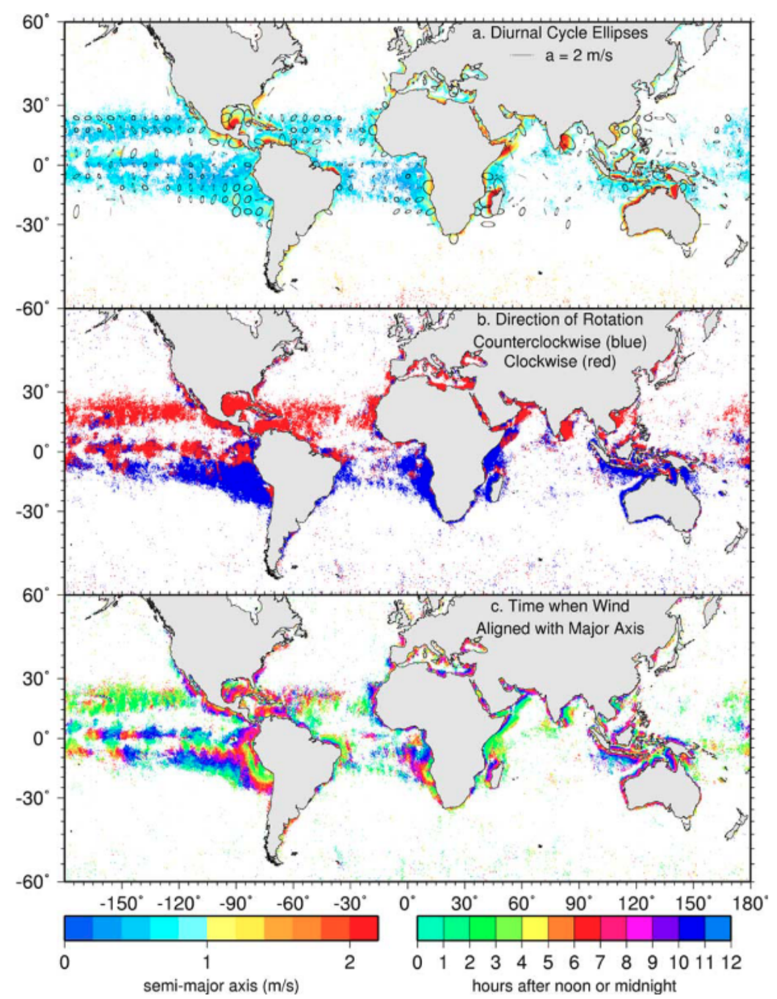

# Project Title: Diurnal cycle of coastal winds and rainfall (hk25-coastal)

### Project Details

#### Project Lead: Andrew Brown (a.brown1@unimelb.edu.au) and Bethan White (bethan.white@monash.edu)

#### Project members:

#### Number of open slots for students:

#### Expertise needed:

Python, Jupyter notebooks, GitHub

### Project Description

#### Background:

The diurnal (daily) cycle in wind and rainfall is important to understand for weather forecasting in coastal regions and has an impact on the climate system through convection in the tropics. However, numerical models often have biases in the timing, amplitude, and location in the diurnal cycle compared with observations. This project will investigate the diurnal cycle in wind and rainfall in global convection-permitting models, with a focus on the offshore propagation of winds and rainfall related to the sea/land breeze circulation. In addition to providing insight to the physical processes occurring in these high-resolution models, the results may be able to be used in the future to guide the parameterisation of these small-scale processes in coarser models.

#### Primary research question:

What is the global distribution of coastal and offshore diurnal wind variability in different models, including those with and without parameterised convection, and how does this compare with previous theoretical and observational studies (Rotunno 1983, Gille et al. 2005, Short et al. 2019)?

#### Secondary research questions:

·   	How does the distribution and timing of diurnal wind variability relate to diurnal variability in rainfall in different regions of the globe?  
·   	Can sea breeze identification methods be applied to global model data, to investigate sea breeze characteristics?

#### Primary output:

·   	Plots to compare the modelled global diurnal wind variability with the observational findings of Gille et al. (2005), for all available models (see Figure 1).  
·   	Similar plots comparing diurnal wind and rainfall variability across the globe, with summary figures for different regions/latitudes/land types (land versus ocean).  
·   	Code and notebooks for analysing the diurnal cycle from model data.

#### Secondary outputs:

·   	Code and notebooks that apply [this code repository](https://github.com/andrewbrown31/sea_breeze/tree/main) to global model data for sea breeze identification.  
·   	Plots of the number of sea breeze days over the one-year period.

Figure 1, from Gille et al. (2005): “(a) Strength of diurnal wind cycle, with major axis plotted in color in locations where it is statistically significant, and wind ellipses plotted every 6 degrees in locations that are either within 10 degrees of land or equatorward of 30 degrees latitude. Reference line indicates the major axis for an ellipse with semi-major axis a \=2m/s. (b) Direction of rotation of wind. Red indicates clockwise and blue counter-clockwise rotation. (c) Time of day when wind is aligned with major axis. (Winds are aligned with the major axis twice a day.)”

### Methodology

#### Datasets: 

Global data  
For primary questions:  
·   	U and V winds at 10 m  
·   	Land sea mask  
   
Secondary questions:  
·   	Surface rainfall  
·   	Near-surface temperature  
·   	Near-surface specific humidity/mixing ratio  
·   	U and V winds on model levels (not essential)  
·   	Boundary layer height (not essential)

#### Methods:

**Diurnal cycle of wind**  
We will calculate the amplitude of the diurnal cycle in wind in one of the following two ways, applied to hourly average composites at each grid point for the whole year of data. They are ordered by simplicity, such that we can use method 1 first, and advance to method 2 if required.

1\. 	Take the difference between the maximum and minimum hourly composited average wind speeds. We could either use the total wind speed or winds resolved in the local offshore direction (would require using [this code](https://github.com/andrewbrown31/sea_breeze/blob/main/load_model_data.py#L591) to find the dominant coastline angle for each point).

2\. 	Fit ellipses to U and V wind components as in the study of Gille et al. (2005) and calculate the semi-major axis length and orientation.  
   
The advantage of method 2 is that it will provide smoother outputs and is consistent with Gille et al. (2005). The timing of the diurnal cycle can be diagnosed by the time of the daily wind speed maximum, either by finding the time that the ellipse aligns with the major axis, or by sorting the hourly composite values. Timing analysis requires a conversion to local solar time from UTC.  
   
**Diurnal cycle of rainfall**  
The diurnal cycle in rainfall can be calculated by taking the difference between maximum and minimum hourly composited values. The timing can be diagnosed by sorting the hourly composite values. A harmonic function could be fit to the daily rainfall cycle to provide smoother results, analogous to the ellipse approach in the wind method outlined above (but done here for one variable, rather than a multivariate approach with U and V).  
   
**Sea breeze identification**  
For identifying sea breeze objects, [this code repository](https://github.com/andrewbrown31/sea_breeze/tree/main) will be applied. Note that this method is still under development and has not yet been applied to global data. This code may need to be applied regionally due to memory constraints.  
 

#### References:

Gille, S. T., Llewellyn Smith, S. G., & Statom, N. M. (2005). Global observations of the land breeze. Geophysical Research Letters, 32(5), 1–4. https://doi.org/10.1029/2004GL022139  
   
Rotunno, R. (1983). On the Linear Theory of the Land and Sea Breeze. Journal of the Atmospheric Sciences, 40(8), 1999–2009. https://doi.org/https://doi.org/10.1175/1520-0469(1983)040\<1999:OTLTOT\>2.0.CO;2  
   
Short, E., Vincent, C. L., & Lane, T. P. (2019). Diurnal Cycle of Surface Winds in the Maritime Continent observed through Satellite Scatterometry. Monthly Weather Review, MWR-D-18-0433.1. https://doi.org/10.1175/MWR-D-18-0433.1

